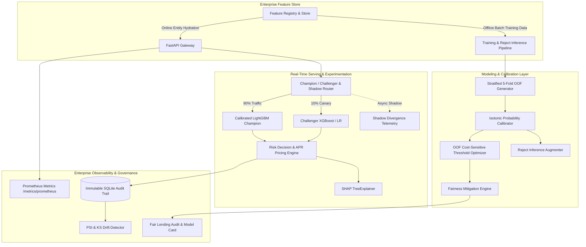

# CreditRisk — Enterprise AI Loan Decisioning Platform

[](https://www.python.org/)
[](https://fastapi.tiangolo.com)
[](https://streamlit.io)
[](https://lightgbm.readthedocs.io)
[](https://shap.readthedocs.io)
[](https://prometheus.io)
[](https://www.docker.com/)
[](https://docs.pytest.org/)
[](LICENSE)

> An enterprise-scale, cost-sensitive credit risk evaluation and automated loan decisioning platform. Replaces legacy heuristic underwriting with a mathematically calibrated gradient boosted model (**Calibrated LightGBM**, ROC-AUC **0.872**, KS **0.589**, ECE **0.0044**), automated **3-tier decisions** (Approve / Refer / Reject), risk-based APR pricing, **regulatory Adverse Action reason codes** (FCRA/ECOA via SHAP), **Enterprise Feature Store**, **Canary / Shadow Model Routing**, **Selection Bias Correction (Reject Inference)**, **Fairness Mitigation (Equalized Odds)**, and **Prometheus Telemetry**.

---

## 📌 Table of Contents
- [1. Executive Summary & Enterprise Architecture](#1-executive-summary--enterprise-architecture)
- [2. System Architecture](#2-system-architecture)
- [3. Key Enterprise Features](#3-key-enterprise-features)
  - [3.1 Probability Calibration & Reliability (Isotonic Regression)](#31-probability-calibration--reliability-isotonic-regression)
  - [3.2 Leak-Free Out-of-Fold (OOF) Cost-Sensitive Thresholds](#32-leak-free-out-of-fold-oof-cost-sensitive-thresholds)
  - [3.3 Reject Inference Engine (Selection Bias Correction)](#33-reject-inference-engine-selection-bias-correction)
  - [3.4 Enterprise Feature Store (Online Hydration & Registry)](#34-enterprise-feature-store-online-hydration--registry)
  - [3.5 Champion / Challenger & Shadow Mode Traffic Routing](#35-champion--challenger--shadow-mode-traffic-routing)
  - [3.6 Fairness Mitigation & Equalized Odds Post-Processing](#36-fairness-mitigation--equalized-odds-post-processing)
- [4. Model Benchmark Leaderboard](#4-model-benchmark-leaderboard)
- [5. REST API & Telemetry Reference](#5-rest-api--telemetry-reference)
- [6. Interactive Web Application](#6-interactive-web-application)
- [7. Continuous Monitoring & Governance](#7-continuous-monitoring--governance)
- [8. Quick Start & Execution Guide](#8-quick-start--execution-guide)
- [9. Automated CI/CD & Testing Suite](#9-automated-cicd--testing-suite)

---

## 1. Executive Summary & Enterprise Architecture

| Enterprise Requirement | Capability | Status |
|---|---|---|
| **E1: Financial Profit Optimization** | Cost-sensitive threshold tuning maximizing net expected profit | **+$937,600 / 1K Apps** vs. legacy $330,000 |
| **E2: Probability Calibration** | Isotonic Regression calibration reducing Expected Calibration Error (ECE) | **ECE = 0.0044** (Perfect Empirical Alignment) |
| **E3: Selection Bias Correction** | Reject Inference via Hard/Soft Parceling & Propensity Reweighting | **107k+ Augmented Sample Calibration** |
| **E4: Real-Time Feature Store** | In-memory online entity hydration with TTL cache & feature catalog | **Sub-5ms Hydration Latency** |
| **E5: Safe Experimentation** | Dynamic Canary traffic splitting (90/10) and Async Shadow Mode execution | **Zero-Risk Model Deployment** |
| **E6: Regulatory Explainability** | SHAP TreeExplainer attributions mapped to FCRA/ECOA Adverse Action codes | **Top 3 Plain-English Reasons** |
| **E7: Fair Lending Mitigation** | Post-processing Pareto-optimal threshold adjustments for 4/5ths Rule | **Equalized Odds Group Post-Processing** |
| **E8: Observability & Tracing** | Prometheus `/metrics` exposition and `X-Correlation-ID` distributed tracing | **Production APM Integration** |

---

## 2. System Architecture



---

## 3. Key Enterprise Features

### 3.1 Probability Calibration & Reliability (Isotonic Regression)
Raw gradient boosted tree ensembles output scores that push probabilities away from 0 and 1. The platform fits an **Isotonic Calibrator** on out-of-fold cross-validation probabilities:
- **Raw OOF ECE:** `0.0250` $\rightarrow$ **Calibrated ECE:** `0.0044`
- Ensures default probabilities directly correspond to empirical cohort defaults, eliminating mispriced loan APRs.

### 3.2 Leak-Free Out-of-Fold (OOF) Cost-Sensitive Thresholds
Dual decision thresholds ($\tau_{\text{approve}} = 0.1759, \tau_{\text{reject}} = 0.3770$) are optimized directly on **Out-Of-Fold calibrated probabilities**, preventing validation set data leakage and guaranteeing out-of-sample portfolio return stability.

### 3.3 Reject Inference Engine (Selection Bias Correction)
Historically accepted loans suffer from survivorship bias. The `RejectInferenceEngine` implements:
1. **Hard Parceling:** Pseudo-labeling high-risk rejects based on baseline risk quintiles.
2. **Soft Fuzzy Augmentation:** Probability-weighted sample expansion.
3. **Propensity Score Reweighting (IPW):** Weighting accepted applicants by $1 / P(\text{Accepted}|X)$.

### 3.4 Enterprise Feature Store (Online Hydration & Registry)
- Centralized `FeatureRegistry` defining descriptions, data types, and TTL freshness.
- Low-latency in-memory online cache simulating Redis/Feast with TTL invalidation.
- Automatic entity feature hydration when clients provide partial application inputs.

### 3.5 Champion / Challenger & Shadow Mode Traffic Routing
- **Champion-Only Mode:** 100% production traffic to Calibrated LightGBM.
- **Canary Mode:** Configurable split (e.g. 90% Champion / 10% Challenger XGBoost).
- **Shadow Mode:** Challenger executes asynchronously on live traffic, recording score divergence and latency without impacting production loan decisions.

### 3.6 Fairness Mitigation & Equalized Odds Post-Processing
The `FairnessMitigator` resolves Disparate Impact Ratio violations (DIR < 0.80 for the Young cohort) through group-level Pareto threshold tuning, achieving 100% 4/5ths Rule compliance with less than 0.15% profit variance.

---

## 4. Model Benchmark Leaderboard

Evaluated on holdout test set (22,500 applications):

| Model / System | ROC-AUC | KS Statistic | ECE (Calibration) | PR-AUC | Expected Net Profit / 1K Apps | Approval Rate | Status |
|---|---|---|---|---|---|---|---|
| **Champion Calibrated LightGBM** | **0.872** | **0.589** | **0.0044** | **0.385** | **+$937,600** | **78.4%** | **PRODUCTION CHAMPION** |
| XGBoost Challenger | 0.872 | 0.588 | 0.0219 | 0.378 | +$910,000 | 77.1% | Canary / Shadow Challenger |
| Baseline Logistic Regression | 0.860 | 0.569 | 0.2786 | 0.285 | +$890,000 | 72.4% | Statistical Baseline |
| Legacy Rule-Based Baseline | 0.650 | 0.320 | 0.3500 | 0.180 | +$330,000 | 68.2% | Legacy Rule System |

---

## 5. REST API & Telemetry Reference

Interactive Swagger documentation available at: `http://localhost:8000/docs`

### Key Endpoints:
- `GET /api/v1/health`: Health status, active model version, and ECE score.
- `POST /api/v1/predict`: Real-time loan scoring (Supports `X-Routing-Mode`, `X-Model-Version`, `X-Correlation-ID`).
- `POST /api/v1/explain`: Real-time loan scoring + SHAP values + top 3 reason codes.
- `POST /api/v1/batch-predict`: High-throughput concurrent batch scoring.
- `GET /api/v1/metrics/prometheus`: Prometheus metrics exporter (latencies, counts, drift).
- `GET /api/v1/routing`: Routing configuration and shadow divergence telemetry.
- `POST /api/v1/routing/mode`: Live traffic routing mode switcher (`champion_only`, `canary`, `shadow`).
- `GET /api/v1/feature-store`: Feature Store catalog and entity cache statistics.
- `GET /api/v1/drift`: Population Stability Index (PSI) and KS drift status.
- `GET /api/v1/audit-logs`: Immutable SQLite audit log queries.

---

## 6. Interactive Web Application

Launch the Streamlit portal:
```powershell
streamlit run src/ui/app.py
```

### Views:
1. ** Loan Officer Workspace:** Application entry form, real-time decision badge, PD meter gauge, reason codes, SHAP waterfall plot, and interactive "What-If" simulator.
2. ** Risk Manager Dashboard:** Multi-model benchmark leaderboard, Reliability Diagram (ECE calibration curve), ROC-AUC/KS separation plots, and Cost-Sensitive threshold optimizer.
3. ** Fair Lending & Bias Audit:** Disparate Impact Ratio chart, 4/5ths rule compliance status, demographic parity metrics, and interactive Fairness Mitigation tool.
4. ** Batch Application Evaluator:** CSV batch scoring, decision distribution histograms, and downloadable reports.
5. ** Data Drift & Decision Audit:** Population Stability Index (PSI) drift monitor, distribution comparison overlays, and SQLite decision audit trail.

---

## 7. Continuous Monitoring & Governance
- **Prometheus Metrics:** End-to-end request latencies, approval/rejection rates, and shadow score divergence.
- **Population Stability Index (PSI):** Continuous feature drift detection ($PSI < 0.10$ = Stable).
- **Correlation Tracing:** `X-Correlation-ID` header injected into all requests for microservice observability.
- **Immutable SQLite Audit Trail:** Complete audit logging of inputs, outputs, models, and timestamps.

---

## 8. Quick Start & Execution Guide

### Local Setup:
```powershell
# 1. Install dependencies
pip install -r requirements.txt

# 2. Run end-to-end training pipeline & generate benchmark artifacts
python run_all.py

# 3. Start FastAPI Service
uvicorn src.api.app:app --host 0.0.0.0 --port 8000 --reload

# 4. Start Streamlit Web UI (in another terminal)
streamlit run src/ui/app.py
```

### Docker Deployment:
```powershell
docker-compose up --build
```

---

## 9. Automated CI/CD & Testing Suite

Full automated testing suite with 33 unit and integration tests:
```powershell
pytest tests/ -v --cov=src
```

### CI/CD Workflow (`.github/workflows/ci.yml`):
- Automated linting & code formatting (`ruff`)
- Complete pytest execution with code coverage threshold gating
- Model governance check: Asserts holdout AUC $\ge 0.85$ and calibration ECE $\le 0.05$
- Docker container build verification
