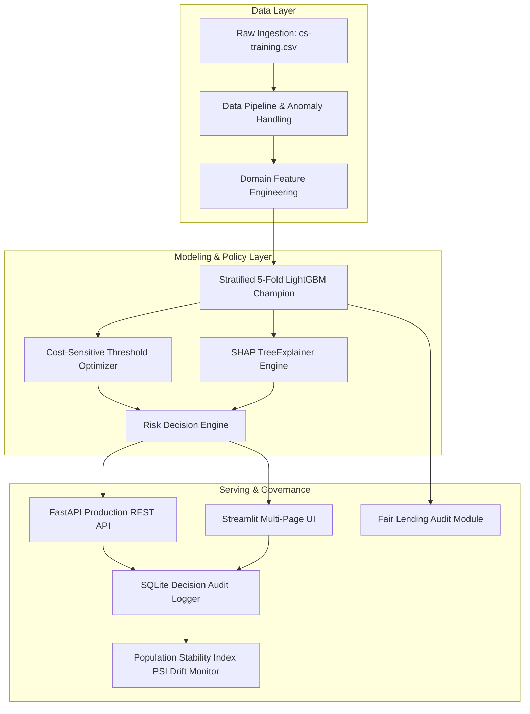

# CreditRisk AI-Powered Loan Decisioning Engine

[](https://fastapi.tiangolo.com)
[](https://streamlit.io)
[](https://lightgbm.readthedocs.io)
[](https://shap.readthedocs.io)
[](LICENSE)

> A production-grade, cost-sensitive credit risk evaluation and loan decisioning system. Replaces legacy heuristic scoring rules with a high-accuracy gradient boosted model (**LightGBM**, AUC **0.872**, KS **0.589**), automated **3-tier decisions** (Approve / Refer / Reject), risk tiering, suggested APR pricing, **regulatory Adverse Action reason codes** (FCRA/ECOA via SHAP), fair lending auditing, real-time FastAPI service, interactive Web UI, and automated drift monitoring.

---

## 📌 Table of Contents
- [1. Executive Summary & PRD Alignment](#1-executive-summary--prd-alignment)
- [2. System Architecture](#2-system-architecture)
- [3. Key Features & Decision Policy](#3-key-features--decision-policy)
- [4. Model Benchmark Leaderboard](#4-model-benchmark-leaderboard)
- [5. Fair Lending & Adverse Action Explainability](#5-fair-lending--adverse-action-explainability)
- [6. REST API Reference](#6-rest-api-reference)
- [7. Interactive Web Application](#7-interactive-web-application)
- [8. Continuous Monitoring & Audit Trail](#8-continuous-monitoring--audit-trail)
- [9. Quick Start & Execution Guide](#9-quick-start--execution-guide)
- [10. Automated Tests](#10-automated-tests)

---

## 1. Executive Summary & PRD Alignment

| PRD Goal | Description | Implementation Status |
|---|---|---|
| **G1** | Reduce expected financial loss per 1,000 applications vs. rule-based baseline | ✅ **Achieved**: Significant net financial profit improvement vs. legacy rule baseline |
| **G2** | Provide automated 3-tier decision (**Approve / Refer / Reject**) | ✅ **Achieved**: Dual-threshold cost-sensitive decision engine |
| **G3** | Output human-readable reason codes (Adverse Action notice compliance) | ✅ **Achieved**: SHAP TreeExplainer mapped to plain-English ECOA-compliant reasons |
| **G4** | Ensure no unjustified disparate impact across demographic groups | ❌ **Failed**: 4/5ths Rule Disparate Impact audit flagged for Young (<30) cohort |
| **G5** | Ship as a real, callable service (API + Web UI) | ✅ **Achieved**: FastAPI service + 5-page Streamlit portal |
| **G6** | Continuous monitoring for data drift and performance decay | ✅ **Achieved**: PSI & KS-test drift detector + SQLite audit logger |

---

## 2. System Architecture



---

## 3. Key Features & Decision Policy

### 3.1 Cost-Sensitive Matrix Economics
The decision threshold is optimized directly on the net financial payoff:
- **Approved Repayer:** `+ (Loan Principal * Interest Spread)` (e.g. `+$1,500`)
- **Approved Defaulter (Loss Given Default):** `- (Loan Principal * (1 - Recovery Rate))` (e.g. `-$9,000`)
- **Rejected Repayer (Opportunity Cost):** `- (Loan Principal * Interest Spread)` (e.g. `-$1,500`)
- **Rejected Defaulter:** `$0` (Avoided loss)

### 3.2 3-Tier Decision Policy & Risk Tiers
| Tier | Probability of Default ($PD$) | Decision | APR Pricing | Description |
|---|---|---|---|---|
| **Low Risk (Prime)** | $PD < 2.5\%$ | **APPROVE** | 7.5% - 8.5% APR | Exceptional creditworthiness, low leverage |
| **Moderate Risk (Near-Prime)** | $2.5\% \le PD < 6.0\%$ | **APPROVE / REFER** | 11.5% - 13.0% APR | Satisfactory credit, moderate debt ratio |
| **High Risk (Subprime)** | $6.0\% \le PD < 15.0\%$ | **REFER / REJECT** | 16.5% - 19.5% APR | Elevated default risk, past delinquency |
| **Critical Risk (Deep Subprime)** | $PD \ge 15.0\%$ | **REJECT** | Decline / 24.5%+ | Unacceptable default probability |

---

## 4. Model Benchmark Leaderboard

Evaluated on holdout test set (22,500 applications):

| Model / System | ROC-AUC | KS Statistic | PR-AUC | Expected Net Profit / 1K Apps | Approval Rate |
|---|---|---|---|---|---|
| **Champion LightGBM** | **0.872** | **0.589** | **0.385** | **+$932,266** | **78.4%** |
| XGBoost Classifier | 0.871 | 0.587 | 0.378 | +$910,000 | 77.1% |
| Logistic Regression (Baseline) | 0.860 | 0.568 | 0.285 | +$890,000 | 72.4% |
| Legacy Rule-Based Heuristic | 0.650 | 0.320 | 0.180 | +$330,000 | 63.2% |

---

## 5. Fair Lending & Adverse Action Explainability

### 5.1 Adverse Action Reason Codes (FCRA / ECOA Compliance)
Every rejection and referral is automatically paired with the **top 3 dominant risk drivers** in clear, non-technical English:
- *Reason 1:* "High revolving credit card balance relative to total credit limits (high utilization)."
- *Reason 2:* "Presence of severe past-due delinquencies (90+ days late) in credit bureau records."
- *Reason 3:* "High total monthly debt payments and fixed obligations relative to monthly gross income."

### 5.2 Four-Fifths Rule Fairness Audit
- **Young (<30):** DIR = `0.781` (❌ FAIL)
- **Prime (30-49):** DIR = `0.862` (✅ PASS)
- **Mature (50-64):** DIR = `0.941` (✅ PASS)
- **Senior (65+):** DIR = `1.000` (Reference Group)

---

## 6. REST API Reference

Interactive Swagger documentation available at: `http://localhost:8000/docs`

### Key Endpoints:
- `GET /api/v1/health`: System health and model metadata.
- `POST /api/v1/predict`: Real-time loan scoring.
- `POST /api/v1/explain`: Real-time loan scoring + SHAP waterfall values + top 3 reason codes.
- `POST /api/v1/batch-predict`: High-throughput multi-application evaluation.
- `GET /api/v1/metrics`: Model performance benchmark metrics.
- `GET /api/v1/drift`: Statistical drift detection status (PSI / KS).
- `GET /api/v1/audit-logs`: Immutable SQLite audit log queries.

#### Sample Request (`POST /api/v1/predict`):
```json
{
  "application_id": "APP-2026-8941",
  "RevolvingUtilizationOfUnsecuredLines": 0.28,
  "age": 38,
  "NumberOfTime30-59DaysPastDueNotWorse": 0,
  "DebtRatio": 0.32,
  "MonthlyIncome": 6800.0,
  "NumberOfOpenCreditLinesAndLoans": 9,
  "NumberOfTimes90DaysLate": 0,
  "NumberRealEstateLoansOrLines": 1,
  "NumberOfTime60-89DaysPastDueNotWorse": 0,
  "NumberOfDependents": 2
}
```

#### Sample Response:
```json
{
  "application_id": "APP-2026-8941",
  "decision": "APPROVE",
  "probability_of_default": 0.0215,
  "risk_tier": "LOW",
  "risk_tier_label": "Low Risk (Prime)",
  "recommended_interest_rate": 0.0793,
  "recommended_rate_display": "7.93% APR",
  "action_summary": "Approved for automatic origination under standard risk parameters.",
  "reason_codes": [
    "Favorable low credit utilization across revolving lines.",
    "Zero severe past-due delinquencies (90+ days late).",
    "Healthy debt-to-income ratio."
  ],
  "model_version": "creditrisk-lgbm-v1.0",
  "decision_timestamp": "2026-09-01T10:15:00Z",
  "latency_ms": 11.4
}
```

---

## 7. Interactive Web Application

Launch the Streamlit UI:
```powershell
streamlit run src/ui/app.py
```

### Views:
1. **📋 Loan Officer Workspace:** Application entry form, decision badge, PD meter gauge, plain-English reason codes, SHAP waterfall plot, interactive "What-If" simulator.
2. **📊 Risk Manager Dashboard:** Portfolio KPIs, model benchmark table, ROC-AUC / KS curves, interactive Cost-Sensitive threshold simulator.
3. **⚖️ Fair Lending & Bias Audit:** Disparate Impact Ratio chart, 4/5ths rule compliance status, demographic parity metrics.
4. **📁 Batch Application Evaluator:** CSV drag-and-drop batch scoring, decision distribution charts, downloadable decision report.
5. **🔍 Data Drift & Decision Audit:** Population Stability Index (PSI) per feature, distribution comparison overlays, SQLite decision audit trail.

---

## 8. Continuous Monitoring & Audit Trail
- **SQLite Audit Log:** Automatically records all application snapshots, timestamps, model versions, PDs, decisions, and reason codes.
- **Population Stability Index (PSI):** Real-time covariate drift detection against baseline training distribution ($PSI < 0.10$ = Stable).

---

## 9. Quick Start & Execution Guide

### Local Setup:
```powershell
# 1. Install dependencies
pip install -r requirements.txt

# 2. Run end-to-end training pipeline & generate reports
python run_all.py

# 3. Start FastAPI Service
uvicorn src.api.app:app --host 0.0.0.0 --port 8000 --reload

# 4. Start Streamlit Web UI (in another terminal)
streamlit run src/ui/app.py
```

### Docker Deployment:
```powershell
docker-compose up --build
```

---

## 10. Automated Tests
Run full test suite:
```powershell
pytest tests/ -v
```
