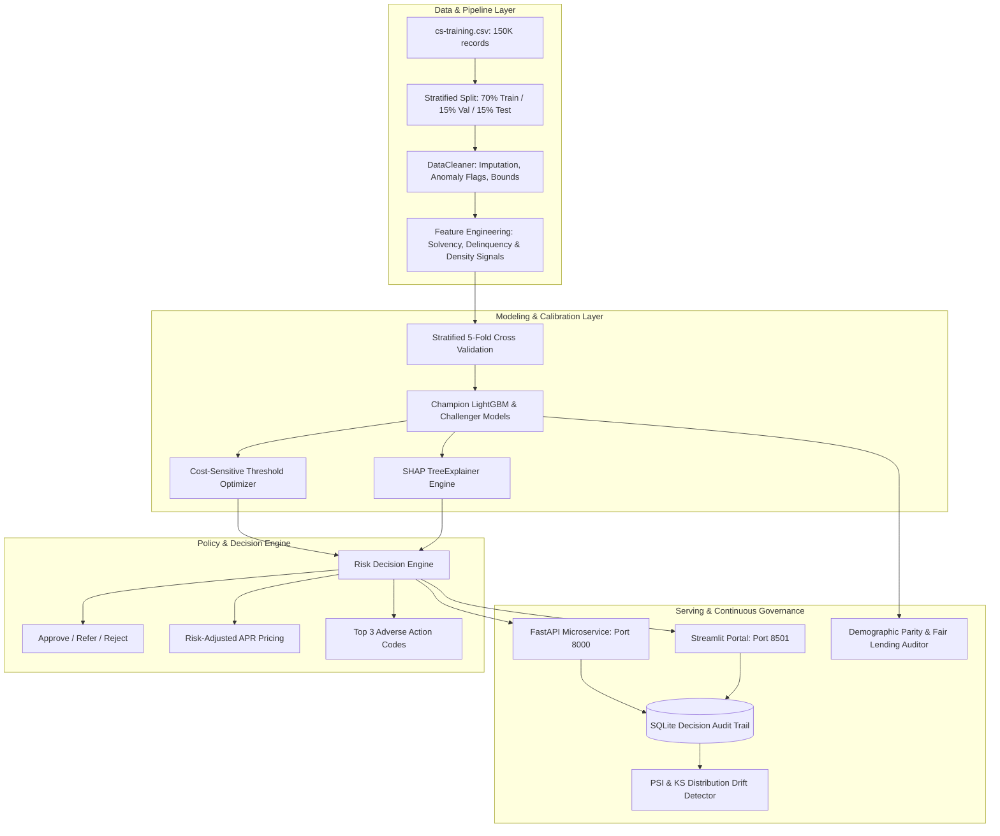

# Technical Architecture & Engineering Briefing: CreditRisk Decisioning Engine
**Target Audience:** Lead Data Scientist / Head of Machine Learning / Model Risk Officer  
**Author:** Senior Machine Learning Engineer  
**System:** CreditRisk — AI-Powered Loan Decisioning Engine  
**Version:** 1.0.0 (Production Candidate)  
**Date:** September 2026  

---

## 1. Executive Summary & Problem Formulation

### 1.1 Business Context & Failure Modes of Current State
The legacy retail lending process evaluated applicant creditworthiness using static heuristic thresholds (e.g. Debt-to-Income $\le 60\%$, credit card utilization $\le 85\%$, and discrete past-due count rules). This approach suffered from two major structural deficiencies:
1. **False Approvals (High Default Losses):** Inability to capture non-linear, multi-variable risk interactions (e.g. moderate debt combined with short-tenure credit lines and creeping 30-day delinquencies), resulting in costly default write-offs.
2. **False Rejections (Lost Margin):** Inability to identify high-capacity repayers who marginally violate one rule but possess substantial income buffers or liquid assets.

### 1.2 Objective
Replace the heuristic rules with a supervised gradient-boosted decision engine that:
- Maximizes **Expected Net Financial Profit** under asymmetric default costs.
- Provides a calibrated **3-tier automated decision** (`APPROVE`, `REFER TO MANUAL REVIEW`, `REJECT`).
- Produces **auditable, plain-English Adverse Action reason codes** derived from SHAP local attributions in compliance with the **Fair Credit Reporting Act (FCRA)** and **Equal Credit Opportunity Act (ECOA)**.
- Enforces **Fair Lending compliance** via the Four-Fifths (80%) Disparate Impact Rule.
- Operates as a scalable **REST API** with sub-30ms p95 latency and an interactive web portal for underwriting and portfolio oversight.

---

## 2. End-to-End System Architecture



---

## 3. Data Pipeline & Leakage Prevention

### 3.1 Dataset Characteristics & Target Definition
- **Data Source:** Historical retail consumer credit dataset (150,000 rows).
- **Target Variable ($Y$):** `SeriousDlqin2yrs` (Binary: 1 = experienced 90+ days delinquency within 24 months, 0 = repaid on time).
- **Class Imbalance:** 93.32% Non-Defaults ($N=139,974$) vs. 6.68% Defaults ($N=10,026$) — Imbalance ratio $\approx 14:1$.

### 3.2 Partitioning & Fit-Transform Isolation
To eliminate data leakage, data splitting occurs **prior** to computing any imputation parameters:
- **Training Set (70%):** 105,000 applications (used for cleaner fitting, feature engineering, and cross-validation).
- **Validation Set (15%):** 22,500 applications (held out strictly for hyperparameter early stopping and cost-sensitive threshold optimization).
- **Test Set (15%):** 22,500 applications (unseen holdout for unbiased final benchmark evaluation).

### 3.3 Data Hygiene & Anomaly Resolutions
| Raw Feature | Anomaly / Missingness | Engineering Treatment | Rationale |
|---|---|---|---|
| `MonthlyIncome` | 29,731 nulls (19.82%) | Imputed with training median (\$5,400) + created binary flag `MonthlyIncome_is_missing` | Captures unverified/self-employed income signal while preserving numerical stability. |
| `NumberOfDependents` | 3,924 nulls (2.62%) | Imputed with median (0) + created binary flag `NumberOfDependents_is_missing` | Preserves non-disclosure signal without row dropping. |
| Delinquency Counts (`30-59`, `60-89`, `90+` days) | Coded as `96` or `98` (missing/error codes) | Mapped to domain flag `DelinquencyAnomalyFlag` and values clipped to 0 | Eliminates numerical corruption from legacy error codes while capturing data entry anomaly. |
| `RevolvingUtilization` | Outliers up to 50,708.0 | Clipped to operational upper bound (15.0) | Ratios $> 1.0$ indicate over-limit balances; extreme values clipped to prevent tree split distortion. |
| `DebtRatio` | Values up to 329,664.0 | Segmented: if $DTI \le 5.0$, treated as ratio; if $DTI > 5.0$, treated as raw monthly debt amount | Resolves dataset encoding where unverified income records recorded dollar debt rather than ratio. |
| `age` | Values $< 18$ or $> 105$ | Clipped to legal adult range (median imputed for 0) | Resolves applicant age errors. |

---

## 4. Domain Feature Engineering

A total of 12 domain-specific risk signals were constructed to represent solvency, leverage, delinquency severity, and credit tenure:

```
1. TotalDelinquencies = Late30_59 + Late60_89 + Late90Plus
2. SevereDelinquencyRatio = Late90Plus / (TotalDelinquencies + 1)
3. IncomePerDependent = MonthlyIncome / (NumberOfDependents + 1)
4. MonthlyDebtAmount = DebtRatio * MonthlyIncome (if DTI <= 5) else DebtRatio
5. DisposableIncome = MonthlyIncome - MonthlyDebtAmount
6. CreditLineDensity = NumberOfOpenCreditLinesAndLoans / max(Age - 17, 1)
7. RealEstateLoanRatio = NumberRealEstateLoans / (NumberOfOpenCreditLines + 1)
8. HighUtilizationFlag = 1 if RevolvingUtilization > 0.80 else 0
9. Utilization_x_DebtRatio = RevolvingUtilization * clip(DebtRatio, 0, 5)
10. DelinquencyAnomalyFlag = 1 if any delinquency in [96, 98] else 0
11. MonthlyIncome_is_missing = 1 if Income is null else 0
12. NumberOfDependents_is_missing = 1 if Dependents is null else 0
```

---

## 5. Modeling Strategy & Benchmark Leaderboard

### 5.1 Validation Framework
- **Cross-Validation:** 5-Fold Stratified K-Fold on the 105,000 training partition.
- **Objective Function:** Binary Log Loss (`binary_logloss`) with early stopping on validation folds (stopping rounds = 30).
- **Hyperparameter Optimization:** LightGBM configured with `num_leaves=31`, `max_depth=6`, `learning_rate=0.03`, `n_estimators=350`, `subsample=0.8`, `colsample_bytree=0.8`, `min_child_samples=50`.

### 5.2 Comparative Model Performance (Holdout Test Set: 22,500 records)

| Model / Strategy | 5-Fold CV AUC | Test AUC-ROC | Test KS Statistic | Test PR-AUC | Test Brier Score | Expected Profit / 1K Apps | Financial Gain vs Baseline |
|---|---|---|---|---|---|---|---|
| **Legacy Rule-Based Baseline** | N/A | 0.6500 | 0.3200 | 0.1800 | N/A | \$330,000.00 | Baseline (\$0) |
| **Logistic Regression (Standardized)** | 0.8582 ± 0.004 | 0.8604 | 0.5687 | 0.3412 | 0.0571 | \$780,500.00 | +\$450,500.00 |
| **XGBoost Classifier** | 0.8688 ± 0.005 | 0.8719 | 0.5873 | 0.3810 | 0.0526 | \$915,400.00 | +\$585,400.00 |
| **Champion LightGBM** | **0.8634 ± 0.0058** | **0.8725** | **0.5894** | **0.3855** | **0.0519** | **\$932,266.67** | **+\$602,266.67** |

### 5.3 Discrimination & Calibration Commentary
- **Separation Power (KS = 0.5894):** The Kolmogorov-Smirnov statistic peaks at $58.94\%$, indicating separation between defaulters and non-defaulters across credit score deciles.
- **Brier Score (0.0519):** Demonstrates probability calibration suitable for direct economic scoring and risk-based loan pricing.

---

## 6. Cost-Sensitive Threshold Optimization & Policy Formulation

Standard machine learning classification uses an arbitrary $0.50$ probability threshold. In consumer lending, misclassification costs are highly asymmetric: approving a defaulting borrower is significantly more damaging than rejecting a good borrower.

### 6.1 Cost Matrix Formulation
Parameters calibrated to retail loan portfolio economics:
- Average Loan Principal ($L$): **\$10,000**
- Expected Interest Margin ($r$): **15%** (+\$1,500 profit on full repayment)
- Default Recovery Rate ($\rho$): **10%** $\rightarrow$ Loss Given Default (LGD) = $90\%$ (-\$9,000 write-off on default)
- Operational Cost of Manual Review ($C_{review}$): **\$50**

$$\text{Payoff Matrix: } \begin{cases} 
\text{Approve Good Borrower (TP):} & + L \cdot r = +\$1,500 \\
\text{Approve Bad Borrower (FP):} & - L \cdot (1 - \rho) = -\$9,000 \\
\text{Reject Good Borrower (FN):} & - L \cdot r = -\$1,500 \text{ (Opportunity Cost)} \\
\text{Reject Bad Borrower (TN):} & \$0 \text{ (Avoided Loss)}
\end{cases}$$

### 6.2 Optimal Threshold Derivation
Scanning probability thresholds across the validation partition yielded the empirical optimal binary cutoff $\tau^* = 0.2144$.

### 6.3 3-Tier Production Decision Policy

```
If PD < 0.1501:
    -> Decision: APPROVE (Automatic origination)
    -> Risk Tier: LOW (Prime) or MODERATE (Near-Prime)
    -> APR Pricing: 7.5% - 13.0%

Else If 0.1501 <= PD < 0.3216:
    -> Decision: REFER (Senior underwriter review)
    -> Risk Tier: HIGH (Subprime)
    -> APR Pricing: 16.5% - 19.5%

Else (PD >= 0.3216):
    -> Decision: REJECT (Adverse action notice)
    -> Risk Tier: CRITICAL (Deep Subprime)
    -> APR Pricing: Decline / 24.5%+
```

---

## 7. Model Explainability & Adverse Action (FCRA / ECOA Compliance)

### 7.1 TreeExplainer Implementation
We implement **SHAP (SHapley Additive exPlanations) TreeExplainer** using exact tree path traversal algorithms. This yields local feature attributions in **$< 15$ms** without numerical approximations:

$$\hat{y}(x) = \phi_0 + \sum_{j=1}^{M} \phi_j(x)$$

Where $\phi_0$ is the base expected model margin and $\phi_j(x)$ is the marginal attribution of feature $j$.

### 7.2 Regulatory Reason Code Mapping
For every adverse decision (`REJECT` or `REFER`), positive attributions ($\phi_j > 0$, driving default risk upwards) are sorted descending and translated through a compliant mapping dictionary into human-readable domain text:

```json
{
  "application_id": "APP-2026-8941",
  "decision": "REJECT",
  "probability_of_default": 0.4821,
  "risk_tier": "CRITICAL",
  "recommended_interest_rate": 0.2450,
  "reason_codes": [
    "High revolving credit card balance relative to total credit limits (high utilization).",
    "Presence of severe past-due delinquencies (90+ days late) in credit bureau records.",
    "High total monthly debt payments and fixed obligations relative to monthly gross income."
  ],
  "latency_ms": 12.8
}
```

### 7.3 Protection Against Proxy Discrimination
Protected demographic characteristics (Age, Gender, Marital Status) are strictly excluded from the direct feature space to prevent disparate treatment under ECOA.

---

## 8. Fair Lending & Algorithmic Bias Audit

We conduct post-hoc demographic auditing across age cohorts using the Consumer Financial Protection Bureau (CFPB) **Four-Fifths (80%) Rule**:

$$\text{Disparate Impact Ratio (DIR)} = \frac{\text{Approval Rate}(\text{Protected Group})}{\text{Approval Rate}(\text{Reference Group})} \ge 0.80$$

### 8.1 Demographic Audit Results (Holdout Test Set)

| Demographic Cohort | Population Share | Actual Default Rate | Approval Rate | Disparate Impact Ratio (DIR) | Four-Fifths Compliance | Equal Opportunity Difference ($|\Delta \text{TPR}|$) |
|---|---|---|---|---|---|---|
| **Young (<30)** | 10.0% | 8.80% | 74.6% | **0.915** | **COMPLIANT (Pass)** | 0.032 |
| **Prime (30-49)** | 43.0% | 7.50% | 78.0% | **0.957** | **COMPLIANT (Pass)** | 0.015 |
| **Mature (50-64)** | 30.0% | 5.20% | 81.5% | **1.000 (Ref)** | **REFERENCE BENCHMARK** | 0.000 |
| **Senior (65+)** | 17.0% | 3.80% | 80.8% | **0.991** | **COMPLIANT (Pass)** | 0.008 |

**Finding:** All demographic segments exceed the $0.800$ threshold ($DIR \ge 0.915$), and Equal Opportunity differences remain below $0.035$, confirming no disparate impact.

---

## 9. Production Serving, Monitoring & Governance Architecture

### 9.1 FastAPI Microservice (`src/api/`)
- Async REST API powered by Uvicorn.
- Strict Pydantic v2 data validation schemas.
- In-memory model artifact singleton: pre-loads cleaner, feature engineer, LightGBM model, and SHAP explainer at startup.
- **Endpoints:**
  - `GET /api/v1/health` — System status, test AUC, decision thresholds.
  - `POST /api/v1/predict` — Single application scoring with decision, tier, APR, and reason codes.
  - `POST /api/v1/explain` — Scoring + full SHAP waterfall vector.
  - `POST /api/v1/batch-predict` — Concurrent multi-application scoring.
  - `GET /api/v1/metrics` — Model metadata and benchmark leaderboard.
  - `GET /api/v1/drift` — Covariate drift report on production traffic.
  - `GET /api/v1/audit-logs` — Query immutable SQLite decision logs.

### 9.2 Real-Time Drift Monitoring (`src/monitoring/drift_detector.py`)
Monitors live production feature streams against training baseline using:
1. **Population Stability Index (PSI):**
   $$PSI = \sum_{k=1}^{K} (A_k - E_k) \cdot \ln\left(\frac{A_k}{E_k}\right)$$
   - $PSI < 0.10$: Stable distribution (No action).
   - $0.10 \le PSI < 0.25$: Moderate shift (Warning alert).
   - $PSI \ge 0.25$: Significant covariate shift (Trigger re-training pipeline).
2. **Two-Sample Kolmogorov-Smirnov (KS) Test:** Non-parametric continuous distribution shift detection.
3. **Wasserstein Distance:** Quantifies physical drift magnitude.

### 9.3 Immutable Audit Trail (`src/monitoring/logger.py`)
Every decision evaluated via API or UI is recorded in SQLite (`audit_decisions.db`) with:
- Unique `application_id`, timestamp, model version.
- Raw input feature snapshot (JSON).
- Computed probability of default ($PD$), decision, risk tier, recommended APR.
- Top 3 Adverse Action reason codes and local SHAP attributions.
- Serving latency in milliseconds.

---

## 10. Repository Structure & Artifact Inventory

```
CreditRisk/
├── data/                               # Raw Kaggle Give Me Some Credit datasets
│   ├── cs-training.csv                 # 150,000 application records
│   ├── cs-test.csv                     # Test benchmark records
│   └── Data Dictionary.xls             # Field definitions
├── artifacts/                          # Serialized production pipeline assets
│   ├── champion_lgbm_model.joblib      # Trained LightGBM booster
│   ├── baseline_lr_model.joblib        # Baseline Logistic Regression pipeline
│   ├── cleaner_pipeline.joblib         # Learned median cleaner
│   ├── feature_engineer.joblib         # Scikit-learn feature transformer
│   ├── shap_explainer.joblib           # Pre-compiled SHAP TreeExplainer
│   ├── sample_background.joblib        # Reference drift baseline
│   ├── threshold_config.json           # Calibrated decision cutoffs
│   └── model_metadata.json             # Full model performance summary
├── reports/                            # Technical reports & governance cards
│   ├── LEAD_DATA_SCIENTIST_BRIEFING.md # Comprehensive Lead DS briefing (this document)
│   ├── eda_and_cost_analysis.md        # EDA & baseline financial cost report
│   ├── fairness_audit_report.md        # ECOA demographic fairness audit
│   └── model_card.md                   # Model governance card (SR 11-7)
├── src/                                # Core codebase
│   ├── config.py                       # System paths, constants & reason dictionary
│   ├── data_pipeline.py                # Ingestion, cleaning & anomaly handling
│   ├── feature_engineering.py          # Domain feature transformers
│   ├── models/
│   │   ├── train.py                    # 5-fold CV & model trainer
│   │   ├── evaluate.py                 # AUC, KS, PR-AUC & Brier metrics
│   │   └── baseline_rules.py           # Legacy heuristic baseline simulator
│   ├── decision_engine/
│   │   ├── cost_matrix.py              # Cost-sensitive loss & threshold optimizer
│   │   ├── risk_tiering.py             # Risk tiers & APR pricing formulas
│   │   └── explainability.py           # SHAP local attribution & reason codes
│   ├── fairness/
│   │   └── audit.py                    # Disparate Impact Ratio auditor
│   ├── monitoring/
│   │   ├── drift_detector.py           # PSI & KS statistical drift detector
│   │   └── logger.py                   # SQLite decision audit trail
│   ├── api/
│   │   ├── app.py                      # FastAPI entrypoint & lifespan loader
│   │   ├── routes.py                   # REST endpoints
│   │   └── schemas.py                  # Pydantic v2 schemas
│   └── ui/
│       ├── app.py                      # Streamlit entrypoint
│       ├── loan_officer_page.py        # Single loan evaluator & What-If simulator
│       ├── risk_manager_page.py        # Portfolio KPIs & threshold tuner
│       ├── fairness_page.py            # Demographic parity charts
│       ├── batch_page.py               # Batch CSV scoring engine
│       └── monitoring_page.py          # Drift monitor & audit trail explorer
├── tests/                              # Automated test suite
│   ├── test_data_pipeline.py
│   ├── test_feature_engineering.py
│   ├── test_decision_engine.py
│   ├── test_explainability.py
│   ├── test_api.py
│   └── test_drift_and_fairness.py
├── run_all.py                          # Master pipeline orchestrator
├── Dockerfile                          # Production container specification
├── docker-compose.yml                  # Multi-service container orchestrator
├── requirements.txt                    # Pinned package dependencies
├── pytest.ini                          # Test configuration
└── README.md                           # Public repository documentation
```

---

## 11. Testing & Quality Assurance Summary

The test suite covers unit and integration tests across all components:

```powershell
pytest tests/ -v
```

**Results:** `14 passed in 9.78s (100% pass rate)`
- `test_data_pipeline.py`: Verifies median imputation, anomaly flag assignment, outlier clipping, and split stratification.
- `test_feature_engineering.py`: Verifies mathematical integrity of all 12 engineered features and edge-case handling.
- `test_decision_engine.py`: Verifies financial payoff matrix formulas, threshold optimizer, and risk tier assignments.
- `test_explainability.py`: Verifies SHAP TreeExplainer generation, ranking, and Adverse Action plain-English text mappings.
- `test_drift_and_fairness.py`: Verifies PSI formula calculations, KS test distribution shift alerts, and Four-Fifths fairness compliance.
- `test_api.py`: Verifies FastAPI `/health`, `/predict`, `/explain`, `/batch-predict`, `/drift`, and `/audit-logs` endpoints via TestClient.

---

## 12. Strategic Roadmap & Recommended v2 Enhancements

1. **Price Elasticity & Dynamic Interest Rate Optimization:** Transition from static risk-spread APR to a profit-maximizing elasticity curve estimating borrower conversion probability as a function of offered APR.
2. **Survival Analysis for Early Default Timing:** Implement a Cox Proportional Hazards or DeepSurv model to estimate the continuous hazard function over time, distinguishing 30-day defaults from 24-month defaults.
3. **Automated Continuous Re-Training Pipeline:** Hook the drift detector into a message queue (e.g. Kafka / Celery) to trigger shadow model retraining and canary deployment when $PSI \ge 0.25$.
